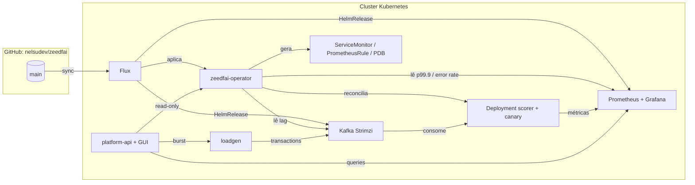

# zeedfai

> Repo: https://github.com/nelsudev/zeedfai — GitOps live via Flux (ver secção "GitOps").
> Documentação exaustiva (o que cada ficheiro/componente faz e porquê): [docs/ARCHITECTURE.md](docs/ARCHITECTURE.md).
> **Step-by-step local demo guide (EN): [docs/LOCAL-DEMO-GUIDE.md](docs/LOCAL-DEMO-GUIDE.md)** — all demos, verified timings.
> **[docs/FAQ.md](docs/FAQ.md)** — common questions and things that break, with fixes.

Plataforma de demonstração de **platform engineering** para fraud-scoring em
streaming: um Kubernetes Operator em Go que gere pipelines de scoring
(Kafka → scorer), com autoscaling por consumer lag, self-healing por SLO
(p99.9 < 250 ms) e entrega via GitOps (FluxCD).

## Arquitetura



O ciclo: commit no Git → Flux aplica → operator reconcilia pipelines →
autoscaler reage ao consumer lag → self-healing reage ao SLO → canary valida
imagens novas com rollback automático → GUI mostra tudo em tempo real.

## Componentes

| Diretório | O quê |
|---|---|
| `operator/` | Operator (controller-runtime): CRD `ScoringPipeline` + reconciler |
| `scorer/` | Serviço Go que consome Kafka e pontua transações, métricas Prometheus |
| `loadgen/` | Gerador de transações sintéticas com modo burst (`POST /burst`) |
| `platform-api/` | API read-only + GUI de operações (lag/réplicas/p99.9 em tempo real, botão de burst) |
| `gitops/` | Estrutura Flux (staging/prod) — fase 3 |
| `runbooks/` | Runbooks ligados aos alertas |
| `scripts/contabo/` | Provisionar um nó k3s+Flux na Contabo via API |
| `hack/` | Manifests de demo local (kind, Strimzi/Kafka) |

## Levantar e testar em local (virtualização com kind/Docker)

O ambiente local corre em **kind** (Kubernetes-in-Docker) — só precisas de Docker.

```bash
# 1. Instalar a toolchain (go, kind, kubectl, helm, flux → ~/.local)
make tools
export PATH="$HOME/.local/bin:$HOME/.local/go/bin:$PATH"

# 2. Subir tudo: cluster kind + Strimzi/Kafka + loadgen + CRD (~5 min)
make demo-up

# 3. Num terminal: correr o operator (fora do cluster, fluxo de dev)
make run

# 4. Noutro terminal: criar um pipeline e observar
make deploy-sample
kubectl get scoringpipelines -w        # Available=True quando as réplicas estiverem prontas
kubectl get deploy,pods                # card-payments-eu-scorer com 2 réplicas

# 5. Testar o burst (2000 ev/s durante 2 min)
make burst
kubectl logs deploy/card-payments-eu-scorer --tail=5

# 6. Ver os recursos de observabilidade que o operator gera por pipeline
kubectl get servicemonitor,prometheusrule,pdb -l zeedfai.io/pipeline=card-payments-eu
kubectl get prometheusrule card-payments-eu-scorer -o yaml   # runbook_url nos alertas

# Grafana (kube-prometheus-stack subiu no demo-up)
kubectl -n monitoring port-forward svc/monitoring-grafana 3000:80   # admin/zeedfai

# Limpar
make demo-down
```

Teste rápido de reconciliação (self-healing básico):

```bash
kubectl delete deploy card-payments-eu-scorer   # o operator repõe-no em segundos
kubectl get deploy -w
```

## GitOps (Flux)

O cluster kind local está bootstrapped com Flux apontado a este repo
(`gitops/clusters/staging`). Strimzi, o cluster Kafka e o kube-prometheus-stack
são geridos por Flux (`HelmRelease` + `Kustomization` com `dependsOn`:
`infra-sources` → `infra-strimzi` → `infra-kafka-cluster`, e `infra-sources` →
`infra-monitoring`). O operator zeedfai e o platform-api correm **in-cluster**,
geridos pelo Flux, com imagens privadas no GHCR (`imagePullSecrets: ghcr-pull`).

GUI de operações: `kubectl -n zeedfai-system port-forward svc/platform-api 8090:8090`
→ http://localhost:8090 (lista de pipelines, gráficos de lag/réplicas/p99.9/throughput
dos últimos 30 min, botão de burst).

```bash
export GITHUB_TOKEN=$(gh auth token)
flux get kustomizations   # todas Ready
flux get helmreleases -A
```

## Roadmap (fases)

- [x] **F0–F2**: toolchain, scorer/loadgen, operator v1 (Deployment/Service + conditions)
- [x] **F2b**: ServiceMonitor + PrometheusRule com `runbook_url` + PDB (métricas rotuladas por `pipeline`)
- [x] **F3**: GitOps completo — operator, Strimzi, Kafka, kube-prometheus-stack, todos geridos pelo Flux
- [x] **F4**: autoscaler por consumer lag + self-healing por SLO p99.9 (verificado: burst 3000ev/s → scale 2→10→2)
- [x] **F5**: canary com rollback automático (verificado: bad-canary com 50% erros → rollback automático em ~80s, guard anti-loop OK)
- [x] **F6**: platform-api read-only + GUI (gráficos + botão de burst); escritas via PR ficam como extensão documentada
- [~] **F7**: Terraform Hetzner pronto e validado (`terraform/hetzner/`) — `apply` pendente de conta/token Hetzner; Contabo (`scripts/contabo/`) como alternativa fixa

## CI/CD (GitHub Actions)

- `ci.yml`: build + vet + test dos três componentes Go em cada push/PR, e build (sem push) das três imagens Docker.
- `teardown-cloud-demo.yml`: destrói qualquer VM de demo (Contabo/Hetzner) esquecida — manual ou todas as noites às 03:00 UTC. Ver `scripts/contabo/README.md` para os secrets necessários.

## Cloud barata: Contabo

`scripts/contabo/` provisiona um VPS com k3s + Flux inteiramente via API da
Contabo (~5€/mês) — ver o README lá dentro.
